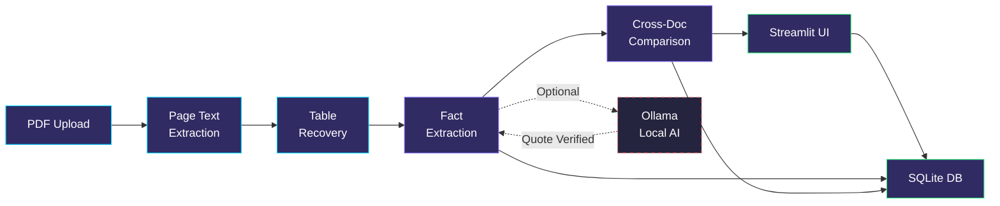

<div align="center">


<br/>
<br/>

<!-- Badges -->
[](https://www.python.org/)
[](https://streamlit.io/)
[](https://docs.pydantic.dev/)
[](https://www.sqlite.org/)
[](https://docs.astral.sh/ruff/)
[](tests/)

<br/>

**An evidence-first fact knowledge layer for cross-document PDF verification.**

*Extract numerical & semantic facts from PDFs, trace every claim to its source passage and page,*
*and classify cross-document relationships as corroboration, contradiction, reconciliation, or insufficient evidence.*

<br/>

[Features](#features) · [Quick Start](#quick-start) · [Architecture](#architecture) · [Tech Stack](#tech-stack) · [Evaluation](#evaluation) · [Contributing](#contributing)

---

</div>

## Features

<table>
<tr>
<td width="50%">

### PDF Fact Extraction
Extract numerical claims, semantic statements, reporting periods, and scope from any PDF — with page-level source evidence.

### Cross-Document Comparison
Compare facts across multiple PDFs. The engine checks metric identity, period, scope, unit, and estimate status before drawing conclusions.

### Precision-Aware Matching
Uses decimal arithmetic and source precision to distinguish rounded corroborations from genuine contradictions — no fixed-percentage tolerance.

</td>
<td width="50%">

### Evidence-First Storage
Every accepted fact ties back to its source passage, PDF page, recovered table rows, and bounding boxes. Nothing is orphaned.

### Optional Local AI
Plug in Ollama models for enhanced extraction. Model-produced claims are rejected unless the quoted evidence exists verbatim in the source page.

### Structured Evaluation
Reproducible benchmarks, exportable results, and a submission-check pipeline with honest coverage reporting.

</td>
</tr>
</table>

<br/>

## Architecture



<details>
<summary><b>Pipeline Details</b></summary>

<br/>

| Stage | Description |
|-------|-------------|
| **Fingerprinting** | SHA-256 content hash for each PDF, enabling deduplication and cache reuse |
| **Page Extraction** | Text extraction + recoverable table rows with bounding boxes and locations |
| **Fact Extraction** | Normalized numerical claims, semantic statements, period/scope detection |
| **Quote Verification** | Ollama model quotes must match page text verbatim before acceptance |
| **Comparison** | Metric identity → period → scope → unit → estimate status → conclusion |
| **Storage** | Atomic transaction writes; previous results survive if processing fails |
| **Run Events** | Typed stage/page/count/elapsed events with downloadable logs |

</details>

<br/>

## Tech Stack

<div align="center">

| Technology | Purpose | Version |
|:---:|:---|:---:|
|  **Python** | Core language | `3.11+` |
|  **Streamlit** | Interactive web UI | `1.49.1` |
|  **Pydantic** | Data validation & models | `2.13.5` |
|  **SQLite** | Local evidence database | Built-in |
| **pdfplumber** | PDF text & table extraction | `0.11.7` |
| **pypdfium2** | PDF page rendering | `4.30.0` |
| **Ollama** | Local AI model inference | Optional |
| **Ruff** | Linting & formatting | `0.13.0` |
| **Pytest** | Testing framework | `8.4.2` |

</div>

<br/>

## Quick Start

### Prerequisites

- **Python 3.11+** recommended
- No external services required — everything runs locally

### Installation

```powershell
# Clone the repository
git clone https://github.com/AnuranjanJain/crosscheck.git
cd crosscheck

# Create virtual environment
python -m venv .venv
.\.venv\Scripts\Activate.ps1

# Install dependencies
python -m pip install -r requirements.txt

# Launch the app
streamlit run app.py
```

> **That's it!** Upload PDFs in the **Documents** tab. All data is stored locally in `crosscheck.db` (SQLite).

<br/>

### Optional: Local AI with Ollama

For enhanced extraction using local language models:

```powershell
# Install Ollama Python client
python -m pip install -r requirements-local-ai.txt

# Pull a model (one-time download)
ollama pull qwen2.5:3b
```

Then in the UI, enable **"Use local Ollama extraction"** and select your model.

<details>
<summary><b>How Ollama integration works</b></summary>

<br/>

- Model requests use `localhost` with a 60-second timeout
- A claim is **rejected** unless its quoted evidence exists verbatim in the source page text
- If the model is unavailable, documents fall back to the baseline extractor
- Installing the Python client does **not** download model weights
- Matching document content + extraction config reuse completed results
- Select **"Reprocess existing documents"** to force re-extraction

</details>

<br/>

## Evaluation

### Running Benchmarks

```powershell
# Run reproducible local benchmark
python scripts/evaluate.py path\to\first.pdf path\to\second.pdf

# Export inspected results
python scripts/export_results.py outputs\evaluation.db

# Full comparison rebuild
python scripts/reconcile.py outputs\evaluation.db
```

### Results Summary

Four actual case outputs are saved in [`evaluation/results.json`](evaluation/results.json):

| Case | Type | Description |
|------|------|-------------|
| **EBITDA Corroboration** | `corroboration` | Cross-PDF: 1266.41M vs 127 crore across two Delhivery reports |
| **EBITDA Reconciliation** | `reconciliation` | FY24 vs FY23 contextual difference |
| **SEC Bank Balance** | `contradiction` | Attributed vs company-reported balance in SEC complaint |
| **IMF Empty Page** | `failure` | No extractable text — graceful handling |

> Strict value/period/unit matching recovered 10/40 Delhivery and 6/40 India regression facts. See [`docs/EVALUATION.md`](docs/EVALUATION.md) for full denominators, timings, model failures, and methodology.

<br/>

## Project Structure

```
crosscheck/
├── app.py                       # Streamlit UI entry point
├── crosscheck/                  # Core package
│   ├── __init__.py
│   ├── compare.py               # Cross-document comparison engine
│   ├── db.py                    # SQLite store with FK enforcement
│   ├── facts.py                 # Fact extraction (numerical + semantic)
│   ├── identity.py              # Metric identity resolution
│   ├── local_ai.py              # Ollama integration
│   ├── models.py                # Pydantic data models
│   ├── pdf.py                   # PDF text/page extraction
│   ├── pipeline.py              # Processing pipeline orchestrator
│   └── tables.py                # Table recovery & attributed comparison
├── docs/                        # Documentation
│   ├── ARCHITECTURE.md          # Design decisions
│   ├── DEMO_SCRIPT.md           # Timed walkthrough script
│   ├── EVALUATION.md            # Evaluation methodology & results
│   └── EVIDENCE_REVIEW.md       # Evidence review notes
├── evaluation/                  # Benchmark labels & results
│   ├── labels/                  # Development & held-out label sets
│   ├── cases.json               # Case definitions
│   ├── results.json             # Saved pipeline outputs
│   └── schema.json              # Label schema
├── scripts/                     # CLI tools
│   ├── evaluate.py              # Run benchmarks
│   ├── export_results.py        # Export results to JSON
│   ├── reconcile.py             # Full comparison rebuild
│   └── submission_check.py      # Validate case references
├── tests/                       # Test suite (32 tests)
│   ├── test_crosscheck.py       # Core extraction & comparison
│   ├── test_processing.py       # Pipeline processing
│   ├── test_streamlit.py        # UI smoke tests
│   └── test_tables.py           # Table recovery tests
├── requirements.txt             # Production dependencies
├── requirements-dev.txt         # Development dependencies
└── requirements-local-ai.txt   # Ollama integration
```

<br/>

## Limitations & Roadmap

<table>
<tr>
<th>Current Limitations</th>
<th>Potential Next Steps</th>
</tr>
<tr>
<td>

- Baseline misses contextual & macroeconomic facts
- Semantic contradiction reasoning not implemented
- Metric/entity identity is heuristic-based
- No OCR or full multi-column reconstruction
- No automatic chunk resume or concurrent workers
- Dollar symbols retained without currency inference

</td>
<td>

- Semantic contradiction engine
- OCR integration for scanned PDFs
- Concurrent worker scheduling
- Automatic page-level resume
- Multi-currency inference
- Full multi-column table reconstruction

</td>
</tr>
</table>

<br/>

## Contributing

### Development Setup

```powershell
# Install dev dependencies
python -m pip install -r requirements-dev.txt

# Run tests
python -m pytest -q

# Lint check
python -m ruff check .
```

### Code Quality

- **32 tests** passing with synthetic fixtures
- **Ruff** linted — zero warnings
- **Pydantic** models enforce the data contract
- **SQLite FK enforcement** — no orphaned records

<br/>

## Additional Notes

- AI assistance was used for implementation, debugging, and regression checks
- Tests use synthetic fixtures for repeatability — they are not accuracy measurements
- No credentials, PDFs, model weights, or generated databases belong in this repository
- The starter ZIP contains Delhivery and India macroeconomy datasets

<br/>

---

<div align="center">

**[⬆ Back to Top](#)**

<br/>

Built by [Anuranjan Jain](https://github.com/AnuranjanJain)

<br/>

<sub>Repository: <a href="https://github.com/AnuranjanJain/crosscheck">AnuranjanJain/crosscheck</a></sub>

</div>
